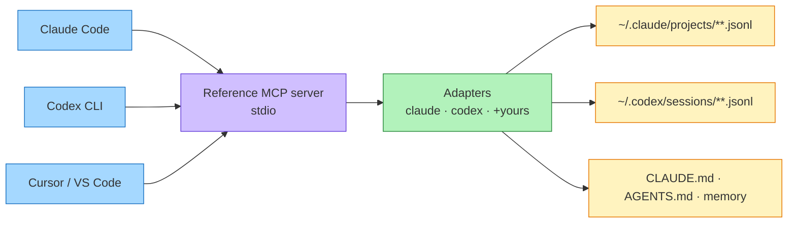

# Reference

> **Let your AI agents search each other's past sessions.**

<!-- LOGO: drop docs/logo.(png|svg) here and embed it above the tagline once ready -->

One [MCP](https://modelcontextprotocol.io) server you register in each tool. It reads every tool's session transcripts **and** memory files (`CLAUDE.md`, `AGENTS.md`, …) from your machine — so any agent can recall what any of them did before. Claude Code forgets what you did in Codex; Codex can't see your Claude history; Cursor knows neither. Reference fixes that.


## Why I built this

I kept asking Claude Code to go reference my Codex chats — to dig up what decisions it had made and *why*. Doing that by hand got old fast, so I built **Reference**. Whenever it's prompted, an agent establishes sessions to get direct access to your history across tools. I've been running it on my own system for a bit and it's been genuinely helpful — so I cleaned it up into a repo. **Would love feedback!**

- 🔁 **Cross-tool, both ways** — Claude Code searches your Codex history; Codex searches your Claude history.
- 🧠 **Sessions _and_ memory** — transcripts plus `CLAUDE.md` / `AGENTS.md` / `memory/*.md`.
- 🔌 **Plug-and-play** — one `uvx` command per tool. No PyPI, no build step.
- 🪶 **Light & offline** — pure-Python BM25 ranking, only dependency is `mcp`. Nothing leaves your machine.
- 🧩 **Extensible** — add a new tool with a few lines of TOML; agents can wire themselves up and open a PR.

> License: MIT · Status: v0.1 · Built-in tools: **Claude Code**, **Codex CLI** (more via config)

---

## Quickstart

Reference runs straight from this repo with [`uv`](https://docs.astral.sh/uv/) — no install, no clone:

```bash
uvx --from git+https://github.com/Kuberwastaken/reference reference-mcp doctor
```

`doctor` prints which tools it can see and how many session/memory files each resolves to. If that lists your sessions, you're ready to register it.

### Register it in your tools

**Claude Code**
```bash
claude mcp add reference -- uvx --from git+https://github.com/Kuberwastaken/reference reference-mcp
```

**Codex CLI** — add to `~/.codex/config.toml`:
```toml
[mcp_servers.reference]
command = "uvx"
args = ["--from", "git+https://github.com/Kuberwastaken/reference", "reference-mcp"]
```

**Cursor** — add to `~/.cursor/mcp.json` (or `.cursor/mcp.json` in a project):
```json
{ "mcpServers": { "reference": { "command": "uvx",
  "args": ["--from", "git+https://github.com/Kuberwastaken/reference", "reference-mcp"] } } }
```

**VS Code (MCP)** — add to `.vscode/mcp.json`:
```json
{ "servers": { "reference": { "command": "uvx",
  "args": ["--from", "git+https://github.com/Kuberwastaken/reference", "reference-mcp"] } } }
```

Any other MCP host: run the command `uvx --from git+https://github.com/Kuberwastaken/reference reference-mcp` as a **stdio** server. `reference-mcp install <claude|codex|cursor|vscode>` prints the exact snippet.

Then just ask your agent things like *"search my past sessions for how we wired the Gemini grounding"* or *"recall what we decided about the scoring model."*

---

## What your agent gets (MCP tools)

| Tool | What it does |
|---|---|
| `recall(query, limit?)` | **Start here.** Best matching past-session turns **and** memory snippets across every tool. |
| `search_sessions(query, source?, project?, role?, since_days?, limit?)` | Full-text search over all session transcripts. Filter by tool, project path, role, or recency. |
| `search_memory(query, source?, limit?)` | Search `CLAUDE.md` / `AGENTS.md` / `memory/*.md` across tools. |
| `list_sessions(source?, project?, limit?)` | Recent sessions (newest first) with tool, project, time, turn count. |
| `get_session(session_ref, max_chars?)` | Full cleaned transcript of one session, by id or path. |
| `list_sources()` | Which tools are configured and how many files each resolves to. |

`source` is a tool name (`claude`, `codex`, …). Omit it to search everything.

---

## How it works



1. **Adapters** (`reference_mcp/adapters.py`) declare, per tool, where transcripts and memory files live and which parser to use. Built-ins cover Claude Code and Codex; more come from your `reference.toml`.
2. **Parsers** (`normalize.py`) turn each tool's JSONL into a uniform `Message` (source, role, text, timestamp, session, project). Tool output is truncated-and-tagged, not dropped, so it stays searchable without bloat.
3. **Search** (`search.py`) is offline BM25 with exact-phrase, recency, and project boosts. Parsed files are cached by mtime; the index rebuilds only when files change.
4. The **MCP server** (`server.py`) exposes the tools above to every host you register it in.

---

## Configuration

Built-ins need **no config**. To add or tweak a tool, drop a `reference.toml` at
`~/.config/reference-mcp/reference.toml` (or point `REFERENCE_MCP_CONFIG` at one). See
[`reference.example.toml`](reference.example.toml):

```toml
[[tool]]
name = "cursor"
session_globs = ["~/.cursor/chats/**/*.jsonl"]
session_format = "generic"   # claude | codex | generic
memory_globs = ["~/.cursor/rules/**/*.md"]
```

Adding a tool makes its history visible **in every other tool** at once. If you wire up a
tool that isn't built in, please contribute it back — see [`AGENTS.md`](AGENTS.md) (an agent
can do this setup itself) and [`CONTRIBUTING.md`](CONTRIBUTING.md).

---

## Privacy & security

Reference is **local-first and read-only**. It reads transcript/memory files already on your
disk and serves results over local stdio to your agent. It does not phone home, upload, or
write to your transcripts. Your sessions can contain secrets and source code — only register
Reference in agents you trust, and never commit your `.reference-cache/` or transcripts.

---

## Credits

Design informed by prior open-source work — [ClaudeHistoryMCP](https://github.com/jhammant/ClaudeHistoryMCP)
(clean offline hybrid search) and [cccmemory](https://github.com/xiaolai/cccmemory) (the first
Claude+Codex cross-tool indexer, now archived). Reference is an independent MIT implementation
focused on being truly multi-tool, plug-and-play, and self-extending.

## License

MIT © 2026 Kuber Mehta
